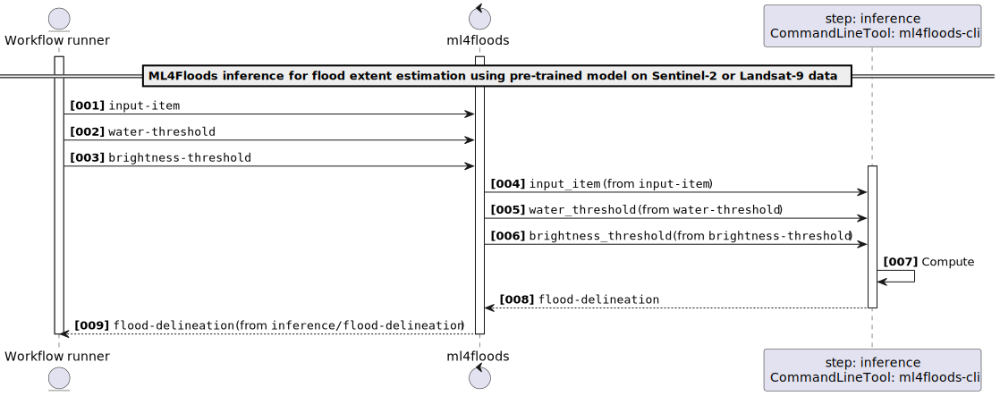

# Transpile a CWL Workflow to a Markdown page

The main purpose of this command is having a human-readable visual representation of a CWL Workflow:

```
$ transpiler-mate markdown --help
Usage: transpiler-mate markdown [OPTIONS] SOURCE

  Transpiles the input CWL to Markdown documentation.

Options:
  --workflow-id TEXT      ID of the main Workflow  [default: main; required]
  --output PATH           The output directory path  [default: .]
  --code-repository TEXT  The (SVN, GitHub, CodePlex, ...) code repository URL
  --help                  Show this message and exit.
```

i.e.

```
$ transpiler-mate markdown \
--workflow-id ml4floods \
--output ./test/ \
--code-repository `git remote get-url origin` \
~/Documents/app-ml4floods-0.2.0.cwl

2026-01-22 16:32:29.846 | INFO     | transpiler_mate.cli:markdown:304 - Rendering Markdown documentation of ~/Documents/app-ml4floods-0.2.0.cwl to test/ml4floods.md...
2026-01-22 16:32:29.846 | INFO     | transpiler_mate.markdown:markdown_transpile:233 - Reading metadata from ~/Documents/app-ml4floods-0.2.0.cwl...
2026-01-22 16:32:29.846 | DEBUG    | transpiler_mate.metadata:__init__:62 - Loading raw document from ~/Documents/app-ml4floods-0.2.0.cwl...
2026-01-22 16:32:29.958 | INFO     | transpiler_mate.metadata:__init__:78 - Resolving License details from SPDX License List...
2026-01-22 16:32:29.958 | INFO     | transpiler_mate.metadata:resolve_license:82 - Detected CC-BY-4.0 indexed in SPDX Licenses
2026-01-22 16:32:29.958 | SUCCESS  | transpiler_mate.markdown:markdown_transpile:236 - Metadata successfully read!
2026-01-22 16:32:29.958 | INFO     | transpiler_mate.markdown:markdown_transpile:237 - Transpiling metadata...
2026-01-22 16:32:29.960 | SUCCESS  | transpiler_mate.markdown:markdown_transpile:242 - Metadata successfully transpiled!
2026-01-22 16:32:29.960 | INFO     | transpiler_mate.markdown:markdown_transpile:243 - Reading Workflow model...
2026-01-22 16:32:29.960 | DEBUG    | cwl_loader:load_cwl_from_yaml:143 - No needs to update the Raw CWL document since it targets already the v1.2
2026-01-22 16:32:29.960 | DEBUG    | cwl_loader:load_cwl_from_yaml:145 - Parsing the raw CWL document to the CWL Utils DOM...
2026-01-22 16:32:29.963 | DEBUG    | cwl_loader:load_cwl_from_yaml:158 - Raw CWL document successfully parsed to the CWL Utils DOM!
2026-01-22 16:32:29.963 | DEBUG    | cwl_loader:load_cwl_from_yaml:160 - Dereferencing the steps[].run...
2026-01-22 16:32:29.963 | DEBUG    | cwl_loader:_on_process:78 - Checking if #ml4floods-cli must be externally imported...
2026-01-22 16:32:29.963 | DEBUG    | cwl_loader:_on_process:82 - run_url:  - uri: io://
2026-01-22 16:32:29.963 | DEBUG    | cwl_loader:load_cwl_from_yaml:167 - steps[].run successfully dereferenced! Dereferencing the FQNs...
2026-01-22 16:32:29.963 | DEBUG    | cwl_loader:load_cwl_from_yaml:171 - CWL document successfully dereferenced! Now verifying steps[].run integrity...
2026-01-22 16:32:29.963 | DEBUG    | cwl_loader:load_cwl_from_yaml:175 - All steps[].run link are resolvable! 
2026-01-22 16:32:29.963 | DEBUG    | cwl_loader:load_cwl_from_yaml:178 - Sorting Process instances by dependencies....
2026-01-22 16:32:29.963 | DEBUG    | cwl_loader:load_cwl_from_yaml:180 - Sorting process is over.
2026-01-22 16:32:29.963 | SUCCESS  | transpiler_mate.markdown:markdown_transpile:251 - Workflow model successfully read!
2026-01-22 16:32:29.983 | INFO     | transpiler_mate.cli:markdown:314 - Markdown documentation successfully serialized to test/ml4floods.md!
```

It is strongly recommended to use this command combined with the [cwl2puml](https://terradue.github.io/cwl2puml/) CLI tool, to render the Workflow, i.e.

```
cwl2puml \
--workflow-id ml4floods \
--output ./test/ \
--convert-image \
--image-format svg \
~/Documents/app-ml4floods-0.2.0.cwl
```

The page will look alike the produced documentation below

---

# ML4Floods inference for flood extent estimation using pre-trained model on Sentinel-2 or Landsat-9 data v0.2.0

ML4Floods is an end-to-end ML pipeline for flood extent estimation using optical satellite data from Sentinel-2 or Landsat-8/9 acquisition

> This software is licensed under the terms of the [Creative Commons Attribution 4.0 International](https://creativecommons.org/licenses/by/4.0/legalcode) license - SPDX short identifier: [CC-BY-4.0](https://spdx.org/licenses/CC-BY-4.0)
>
> 2025-10-29 - 2026-01-22T16:32:29.966 Copyright [Terradue Srl](mailto:info@terradue.com) - > [https://ror.org/0069cx113](https://ror.org/0069cx113)

# Project Team

## Authors

| Name | Email | Organization | Role | Identifier |
|------|-------|--------------|------|------------|
| Brito, Fabrice | [fabrice.brito@terradue.com](mailto:fabrice.brito@terradue.com) | [Terradue](https://ror.org/0069cx113) | [Project Manager](http://purl.org/spar/datacite/ProjectManager) | [https://orcid.org/0009-0000-1342-9736](https://orcid.org/0009-0000-1342-9736) |
| Re, Alice | [alice.re@terradue.com](mailto:alice.re@terradue.com) | [Terradue](https://ror.org/0069cx113) | [Researcher](http://purl.org/spar/datacite/Researcher) | [https://orcid.org/0000-0001-7068-5533](https://orcid.org/0000-0001-7068-5533) |
| Tripodi, Simone | [simone.tripodi@terradue.com](mailto:simone.tripodi@terradue.com) | [Terradue](https://ror.org/0069cx113) | [Project Leader](http://purl.org/spar/datacite/ProjectLeader) | [https://orcid.org/0009-0006-2063-618X](https://orcid.org/0009-0006-2063-618X) |


## Contributors

| Name | Email | Organization | Role | Identifier |
|------|-------|--------------|------|------------|
| Vaccari, Simone | [simone.vaccari@terradue.com](mailto:simone.vaccari@terradue.com) | [Terradue](https://ror.org/0069cx113) | [Researcher](http://purl.org/spar/datacite/Researcher) | [https://orcid.org/0000-0002-2757-4165](https://orcid.org/0000-0002-2757-4165) |


# User Manual

User Manual can be found on [https://eoap.github.io/app-ml4floods/](https://eoap.github.io/app-ml4floods/).


# Runtime environment

## Supported Operating Systems

- Linux
- MacOS X

## Requirements

- [https://cwltool.readthedocs.io/en/latest/](https://cwltool.readthedocs.io/en/latest/)
- [https://www.python.org/](https://www.python.org/)


# Software Source code

- Browsable version of the [source repository](https://github.com/eoap/app-ml4floods.git);
- [Continuous integration](https://github.com/eoap/app-ml4floods/actions) system used by the project;
- Issues, bugs, and feature requests should be submitted to the following [issue management](https://github.com/eoap/app-ml4floods/issues) system for this project


---

# Workflow


## ml4floods

### CWL Class

`Workflow`

### Inputs

| Id | Type | Label | Doc |
|----|------|-------|-----|
| `input-item` | `string` | Optical satellite acquisition | Sentinel-2 or Landsat-9 acquisition to be processed |
| `water-threshold` | `[ null, float ]` | Water threshold | Threshold for water detection (default 0.7) |
| `brightness-threshold` | `[ null, int ]` | Brightness threshold | Threshold for brightness (default 3500) |


### Steps

| Id | Runs | Label | Doc |
|----|------|-------|-----|
| [inference](#ml4floods-cli) | `#ml4floods-cli` | None | None |


### Outputs

| Id | Type | Label | Doc |
|----|------|-------|-----|
| `flood-delineation` | `Directory` | None | None |


### UML Diagrams


#### UML `activity` diagram


#### UML `component` diagram


#### UML `class` diagram


#### UML `sequence` diagram



#### UML `state` diagram


## ml4floods-cli

### CWL Class

```
CommandLineTool
```

### Inputs

| Id | Option | Type |
|----|------|-------|
| `input_item` | `--input-item` | `string` |
| `water_threshold` | `--water-threshold` | `[ null, float ]` |
| `brightness_threshold` | `--brightness-threshold` | `[ null, int ]` |

### Execution usage example:

```
ml4floods-cli \
--input-item <INPUT_ITEM> \
(--water-threshold <WATER_THRESHOLD>) \
(--brightness-threshold <BRIGHTNESS_THRESHOLD>)
```


### Run in step

`inference`
